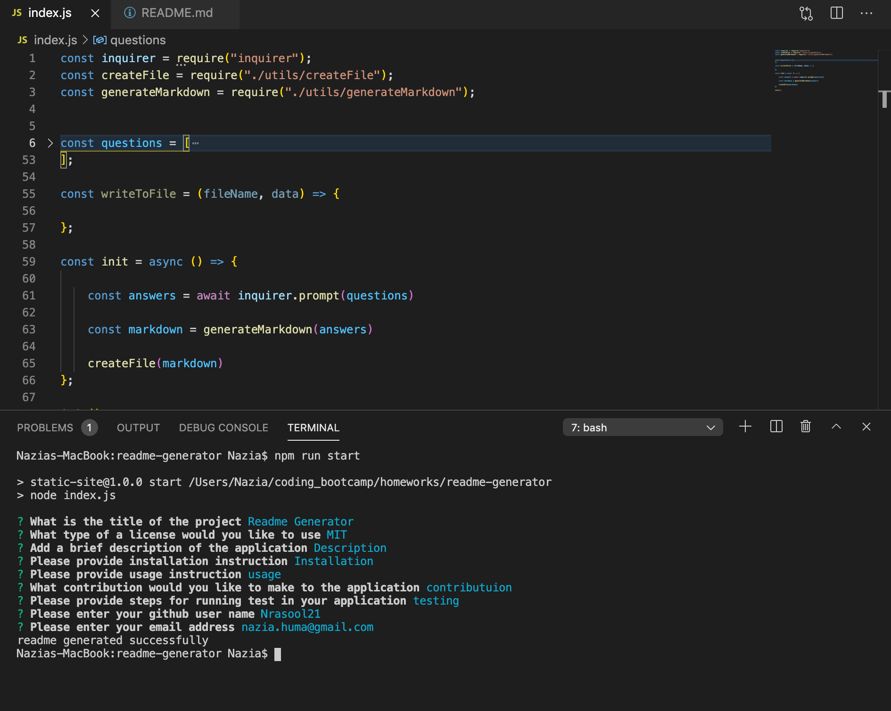
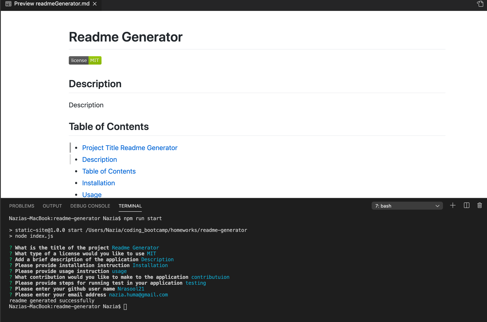

# Title
README-Generator

# Description

We were given a task to create a command-line application that dynamically generates a professional README.md file from a user's input using the Inquirer package. 

# Getting Started

- npm install, this installs the node package file package.json by using command line npm init - y 
- Defined the execution script for my application inside package.json 
- Used inquirer package
- Created gitignore file and boilerplate for file structure
- We started the code with index.js and added inquirer on which I used the prompt method and passed in questions
- Then we built a sample readme file as a template to create it from scratch in javascript
- Then we created generateMarkdown.js with a function that returns the sample readme  string 
-  We destructured the question object and created another module as created.js in where we write to our file. 
- A generated README file is created based on the user enter responses to all of the prompts in the application.
- This matches the user input and has a functioning table of contents.

# Screenshots

# Link To The Video Recording

https://drive.google.com/file/d/1st8GEzqI7MtZ5EgdBB5TUw_OfzzXCXXN/view